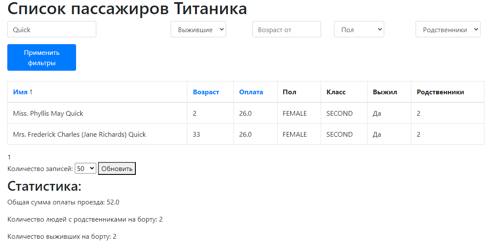

# Titanic Passenger List

## Описание

Это веб-приложение предназначено для отображения списка пассажиров Титаника. 
Оно загружает данные о пассажирах из CSV файла по ссылке, предоставляет функциональность 
поиска, фильтрации, сортировки и пагинации, а также отображает статистику по пассажирам.

## Используемые технологии

- **Java 17**
- **Spring Boot 3** и **Spring Data JPA**
- **PostgreSQL 15** и **Liquibase**
- **Maven** для сборки
- **Thymeleaf** для представления
- **Кэширование - Spring Cache** 

## Требования

- Установленный JDK 17 или выше
- PostgreSQL 12 или выше
- Maven 3.8 или выше

## Установка и настройка

### 1. Клонирование репозитория

Клонируйте репозиторий с исходным кодом:

```bash
git clone https://github.com/NikitaKogtev/titanic-test-task
```

### 2. Настройка PostgreSQL
Создайте базу данных для проекта:

```sql
CREATE DATABASE titanic_db;
```

### 3. Конфигурация приложения

Настройте подключение к базе данных в файле src/main/resources/application.properties:

```properties
spring.datasource.url=jdbc:postgresql://localhost:5432/titanic_db
spring.datasource.username=your username db
spring.datasource.password=your password db
```
### 4. Установка зависимостей
```bash
   mvn clean install
```

### 5. Запуск приложения
```bash
   mvn spring-boot:run
```
   Приложение будет доступно по адресу ```http://localhost:8080/passengers```

    

## Функциональность

### Загрузка данных

При первом запуске приложение автоматически загрузит данные о пассажирах Титаника из CSV файла [https://web.stanford.edu/class/archive/cs/cs109/cs109.1166/stuff/titanic.csv](https://web.stanford.edu/class/archive/cs/cs109/cs109.1166/stuff/titanic.csv) и сохранит их в базу данных.

### Интерфейс пользователя

- **Поиск по имени**: Поле для поиска пассажира по имени.
- **Фильтрация**: Возможность фильтрации по выжившему, возрасту, полу и наличию родственников.
- **Сортировка**: По имени, возрасту и оплате.
- **Пагинация**: Отображение по 50 пассажиров на странице с возможностью изменения количества записей.
- **Статистика**: Общая сумма оплаты, количество людей с родственниками и количество выживших.

### Кэширование

Для улучшения производительности применяется кэширование данных - Spring Cache.